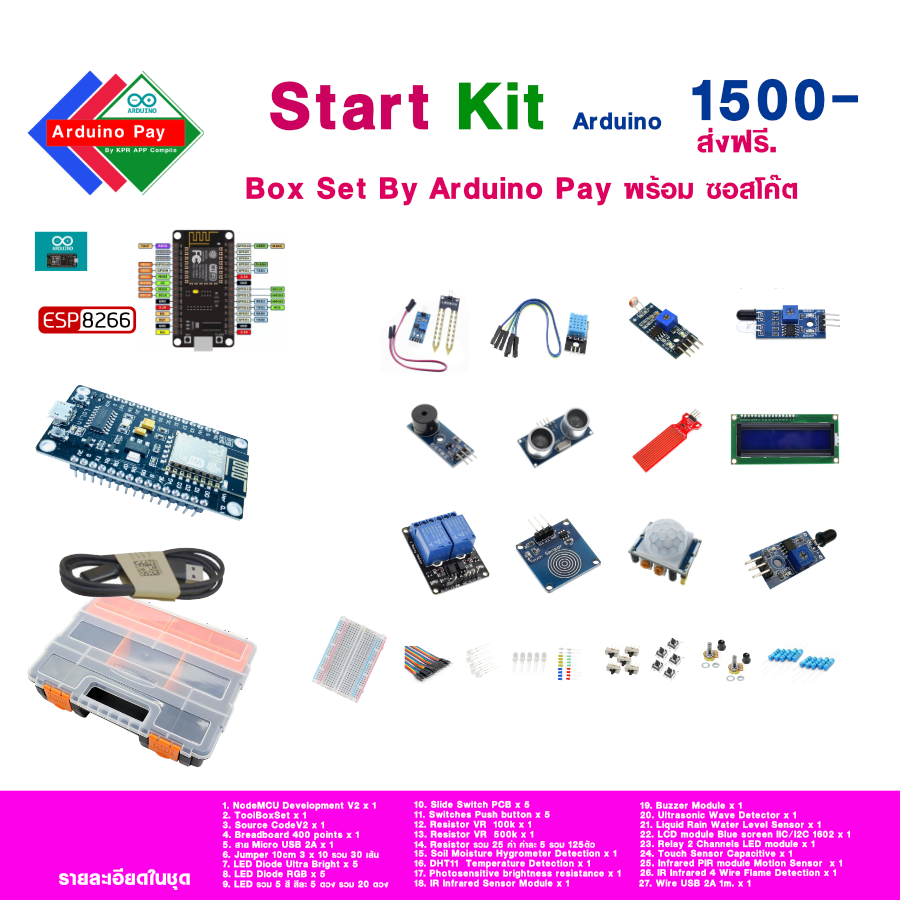

<h1>ArduinoStartKIT</h1>
<h3>ชุดการเรียนรู้ Arduino พร้อม Code ตัวอย่าง โดยใช้ NodeMCU V2 พร้อมอุปกรณ์ Sensor หลายรู้แบบ เขียนโปรแกรมด้วย
Arduino IDE</h3>

  

  

Description : 
ขาย ชุดการเรียนรู้ ที่มาพร้อมอุปกรณ์ ประกอบด้วย 
1. NodeMCU Development V2 x 1  
2. ToolBoxSet x 1  
3. Source CodeV2 x 1  
4. Breadboard 400 points x 1  
5. สาย Data Micro USB 2A x 1  
6. Jumper 10cm 3 x 10 รวม 30 เส้น  
7. LED Diode Ultra Bright x 5  
8. LED Diode RGB x 5  
9. LED รวม 5 สี สีละ 5 ดวง รวม 20 ดวง  
10. Slide Switch PCB x 5  
11. Switches Push button x 5  
12. Resistor VR 100k x 1  
13. Resistor VR 500k x 1  
14. Resistor รวม 25 ค่า ค่าละ 5 รวม 125ตัว  
15. Soil Moisture Hygrometer Detection x 1  
16. DHT11 Temperature Detection x 1  
17. Photosensitive brightness resistance x 1  
18. IR Infrared Sensor Module x 1  
19. Buzzer Module x 1  
20. Ultrasonic Wave Detector x 1  
21. Liquid Rain Water Level Sensor x 1  
22. LCD module Blue screen IIC/I2C 1602 x 1  
23. Relay 2 Channels LED module x 1  
24. Touch Sensor Capacitive x 1  
25. Infrared PIR module Motion Sensor x 1  
26. IR Infrared 3 Wire Flame Detection x 1  

มีกล่องใส่อุปกรณ์เพื่อความสะดวกในการขนย้าย สะดวกต่อการจัดเก็บ

<h3>ติดตั้ง โปรแกรม</h3>
<ul>
<li>
<h4>ติดตั้ง Arduino IDE <a target="_bank" href="https://github.com/kprappcompile/InstallArduinoIDE">การติดตั้ง Arduino IDE</a></h4>
</li>
<li>
<h4>ติดตั้ง Driver USB CP2102 <a target="_bank" href="https://github.com/kprappcompile/installCP2102">การติดตั้ง Driver CP2102</a></h4>
</li>
<li>
<h4>Board NodeMCU ESP8266 V2 <a target="_bank" href="https://github.com/kprappcompile/NodeMCU-V2">รู้จัก NodeMCU V2</a> </h4>
</li>
</ul>

<h3>การเรียนรู้</h3>
<ul>
<li>การใช้งาน LED Diode RGB <a target="_bank" href="https://github.com/kprappcompile/LEDDiodeRGB">Click</a></li>
<li>การใช้งาน LED Diode Ultra Bright <a target="_bank" href="https://github.com/kprappcompile/LEDDiodeUltraBright">Click</a></li>
<li>การใช้งาน Relay 2 Way <a target="_bank" href="https://github.com/kprappcompile/Relay2Way">Click</a></li>
<li>การใช้งาน Soil Moisture Hygrometer Detection<a target="_bank" href="https://github.com/kprappcompile/Soil-Moisture-Hygrometer-Detection">Click</a></li>
<li>การใช้งาน Temperature Detection <a target="_bank" href="https://github.com/kprappcompile/Temperature-Detection">Click</a>
</li>
<li>การใช้งาน Photosensitive brightness resistance <a target="_bank" href="https://github.com/kprappcompile/Photosensitive-brightness">Click</a></li>
<li>การใช้งาน IR Infrared Sensor <a target="_bank" href="https://github.com/kprappcompile/IR-Infrared-Sensor">Click</a></li>
<li>การใช้งาน Buzzer Module <a target="_bank" href="https://github.com/kprappcompile/Buzzer-Module">Click</a></li>
<li>การใช้งาน Ultrasonic Wave Detector <a target="_bank" href="https://github.com/kprappcompile/Ultrasonic-Wave-Detector">Click</a>
</li>
<li>การใช้งาน Liquid Rain Water Level Sensor <a target="_bank" href="https://github.com/kprappcompile/Liquid-Rain-Water-Level-Sensor">Click</a></li>
<li>การใช้งาน LCD Module Blue screen IIC/I2C 1602 <a target="_bank" href="https://github.com/kprappcompile/LCD-Module">Click</a></li>
<li>การใช้งาน Touch Sensor Capacitive <a target="_bank" href="https://github.com/kprappcompile/Touch-Sensor-Capacitive">Click</a>
</li>
<li>การใช้งาน Infrared Motion Sensor Module <a target="_bank" href="https://github.com/kprappcompile/Infrared-Motion-Sensor-Module">Click</a></li>
<li>การใช้งาน Infrared Flame Detection <a target="_bank" href="https://github.com/kprappcompile/Infrared-Flame-Detection">Click</a></li>
</ul>
